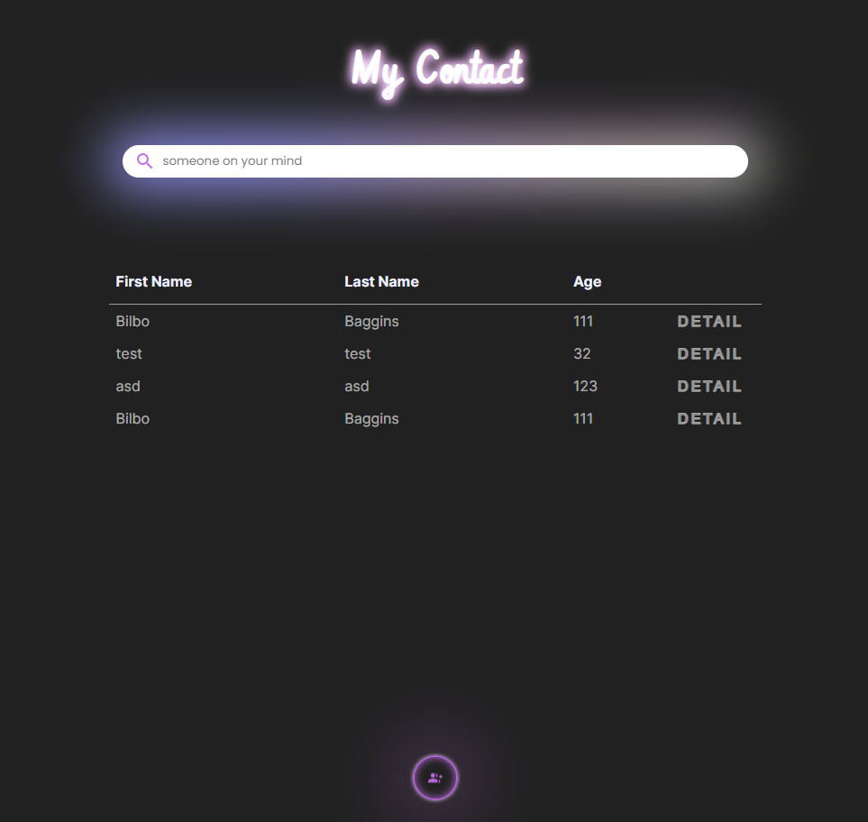

<a id="readme-top"></a>

# &#127930; Front End Enigma test &#127930;

 <br/>
Aplikasi dibuat dengan Nextjs, digunakan untuk membuat, mencari, mendelete, update contact.
User dapat menambah, mengedit, mengupdate, dan delete

## Deployed link

```
Employee : https://layana-test.vercel.app/
```

&nbsp;

## Dibuat dengan

[![React][React.js]][React-url][![Nextjs][Nextjs]][Nextjs-url] <br>
Next.js is an open-source web development framework created by the private company Vercel providing React-based web applications with server-side rendering and static website generation.

[React.js]: https://img.shields.io/badge/React-20232A?style=for-the-badge&logo=react&logoColor=61DAFB
[Nextjs]: https://img.shields.io/badge/Next-black?style=for-the-badge&logo=next.js&logoColor=white
[Nextjs-url]: https://nextjs.org/
[React-url]: https://reactjs.org/

&nbsp;

## Untuk mulai

Siapkan folder project, lalu buka address folder tersebut di terminal dan lakukan command dibawah ini

```
$ git clone https://github.com/code4space/Layana-test.git
$ cd Layana-test/karyawan-client
$ npm install
$ npm run dev
```

_Disarankan menginstall [Git Bash](https://git-scm.com/downloads) terlebih dahulu_

&nbsp;

&nbsp;

<p align="right">(<a href="#readme-top">back to top</a>)</p>
